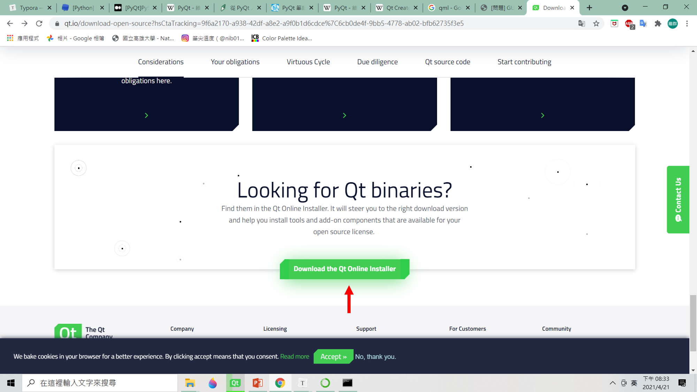
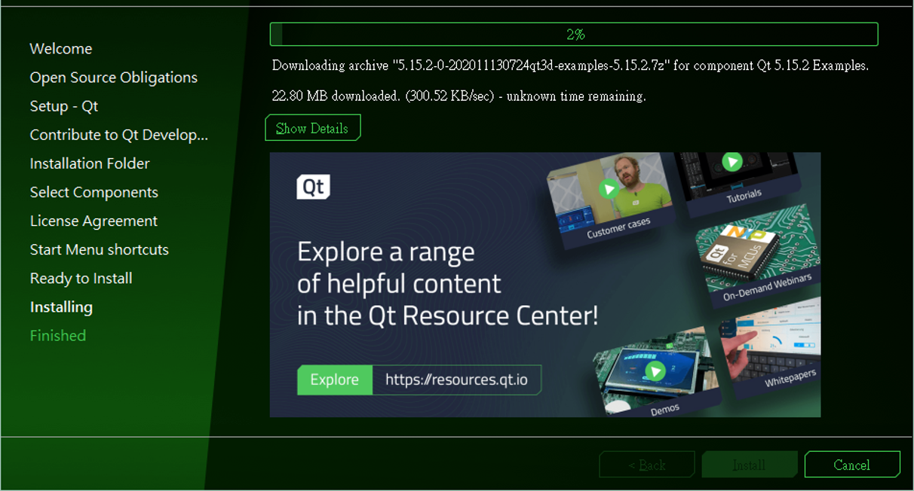

# PyQt5

PyQt是Python製作GUI的套件之一。PyQt包含了大約440個類型、超過6000個的函式和方法。且具備Qt開發經驗，一般可以很快意就熟悉PyQt，如果熟悉PyQt且又熟悉C++的使用者也能迅速的過渡到Qt平台。再者Qt具有圖形化開發介面，也就想畫圖就開用PS，Qt開發了一套GUI程式，讓使用者可以利用簡單的拖拉就完成前端GUI的排版、設計並與後端串接。

## linux

```shell=
pip3 install --user pyqt5  
sudo apt-get install python3-pyqt5  
sudo apt-get install pyqt5-dev-tools
sudo apt-get install qttools5-dev-tools
```

## windos

打開cmd
```shell=
pip3 install --user pyqt5
```


## Qt creator






