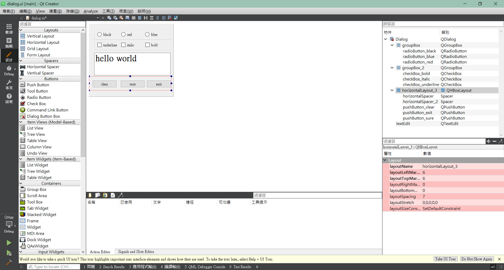
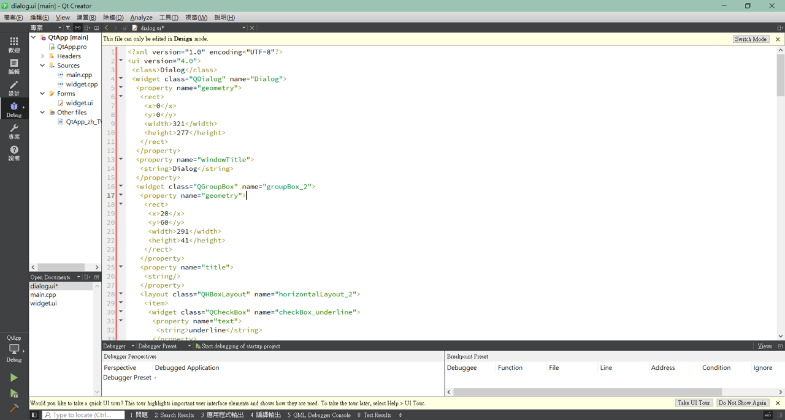
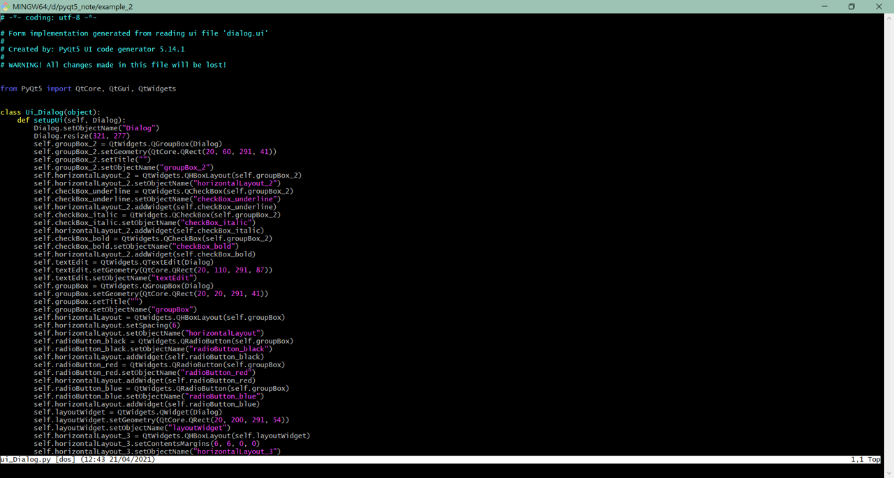

# example_2

利用Qt Creator 製作GUI介面，將想要的元件放置於想要的位置，並調整適合的大小，且可以善加利用水平於垂直元件，善於設定元件的最大和最小寬度或高度屬性，善於設定版面配置的layoutStretch等屬性來達到版面配置效果，最後得到__`.ui`__檔。





接者將生成好的`.ui`檔利用以下指令將其轉換成`.py`檔

```shell
pyuic5 -o <轉換成.py> <被轉換的.ui>

for example:
pyuic5 -o ui_Dialog.py dialog.ui
```

轉換後的`.py`



之後就可以使用轉好的`Ui_Dialog`物件。以下建立`QnewDialog`物件，並在其建置函數中呼叫父類別(QDialog)建置函數，使`self`成為一個`QDialog`物件，並建立`self.ui`為`Ui_Dialog`，透過這種方式將介面與業務邏輯分離。

```python
class QnewDialog(QDialog):

    def __init__(self,parent=None):
        super().__init__(parent)
        self.ui=Ui_Dialog()
        self.ui.setupUi(self)
       
```


##　Signals / Slots

Signals / Slots 是Qt程式設計的一大特色。有了這個設計，Qt中處理介面元件的互動操作變得比較直觀與簡單。

`Signal`就是在特定情況下被發射的一種通告。`Slot`就是對訊號回應的函數，Slot函數可以與一個訊號連結，當訊號被發射時，連結的Slot函數會自動被執行。

```python
def on_pushButton_clear_clicked(self):
        self.ui.textEdit.clear()

    def on_checkBox_bold_toggled(self,checked):
        font=self.ui.textEdit.font()
        font.setBold(checked)       #表示選取狀態
        self.ui.textEdit.setFont(font)

    def on_checkBox_underline_clicked(self):
        checked=self.ui.checkBox_underline.isChecked()
        font=self.ui.textEdit.font()
        font.setUnderline(checked)
        self.ui.textEdit.setFont(font)

    @pyqtSlot(bool)
    def on_checkBox_italic_clicked(self,checked):
    ##def on_checkBox_italic_clicked(self):
        ##checked=self.ui.checkBox_italic.isChecked()
        font=self.ui.textEdit.font()
        font.setItalic(checked)
        self.ui.textEdit.setFont(font)

```

在範例中我在QnewDialog定義3個函數，這三個函數與對應介面元件的訊號連結起來，實現槽與訊號的連結。但是奇怪的是，我們並沒有在QnewDialog類別的建置函數增加任何程式進行訊號與槽的連結。秘密在於Ui_Dialog.py檔中的

```python
QtCore.QMetaObject.connectSlotsByName(Dialog)
```

他會搜尋Dialog表單中的所有元件，將符合的訊號和槽函數，Qt假設槽函數的名稱是:

```__
on_<object_name>_<signal_name>(<signal_parameters>)
```

